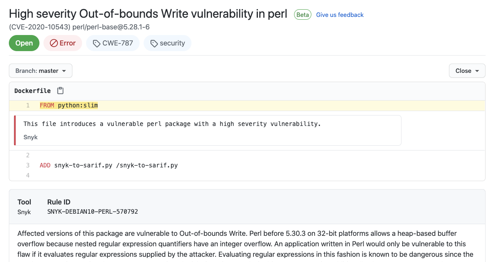

# Snyk to SARIF Action

A [GitHub Action](https://github.com/features/actions) for converting Snyk JSON output to SARIF, for use with GitHub Security.




## Usage

You can use the Action as follows, combining it with the [Snyk Actions](https://github.com/snyk/actions) which do the actual testing:

```yaml
name: Test a Docker image with Snyk

on:
  push:
    branches: [ master ]
  workflow_dispatch:

jobs:
  snyk:
    runs-on: ubuntu-latest
    steps:
    - name: Checkout the code
      uses: actions/checkout@v2
    - name: Build the image
      env:
          DOCKER_BUILDKIT: 1
      run: docker build . -t you-image 
    - name: Run Snyk to check image for vulnerabilities
      continue-on-error: true
      uses: snyk/actions/docker@master
      env:
        SNYK_TOKEN: ${{ secrets.SNYK_TOKEN }}
      with:
        image: your-image
        args: --file=Dockerfile
        json: true
    - uses: garethr/snyk-to-sarif@master
    - uses: actions/upload-artifact@v2
      with:
        name: SARIF
        path: snyk.sarif
    - name: Upload the SARIF file
      uses: github/codeql-action/upload-sarif@v1
      with:
        sarif_file: snyk.sarif
```


## Inputs

The Snyk to SARIF Action has properties which are passed to the underlying image. These are
passed to the action using `with`.

| Property | Default | Description |
| --- | --- | --- |
| input | snyk.json | Where to find the Snyk JSON file |
| file | Dockerfile | Which file in the repository to associate the discovered issues with |
| output | snyk.sarif | Where to save the resulting SARIF file |

All have defaults so in many cases (like the one above) you shouldn't have to pass anything extra.


## Details

Most of the above example is not specific to Snyk to SARIF. The following are the most pertinent parts:

If vulnereabilities are found we still want to upload the SARIF file, so we need to ignore errors.

```yaml
continue-on-error: true
```

The `json` property on the Snyk Action means that, as well as outputing the test results to the console, Snyk will also save the JSON file of the results on the local filesystem.

```yaml
json: true
```

The conversion is being done by the following line. This reads the `snyk.json` file from the previous step and outputs a `snyk.sarif` file.

```yaml  
- uses: garethr/snyk-to-sarif@master
```

Finally we upload the SARIF file to GitHub in order for it to present the results in the Security tab.

```yaml
- name: Upload the SARIF file
  uses: github/codeql-action/upload-sarif@v1
  with:
    sarif_file: snyk.sarif
```
